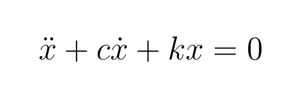
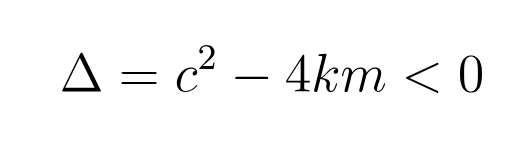
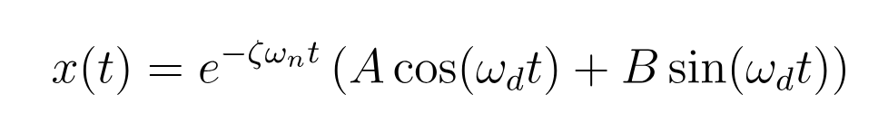
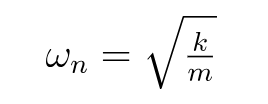
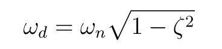
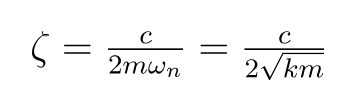
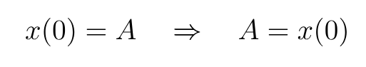
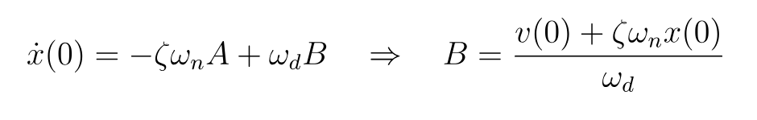

# Bienvenido al repositorio de Damped-Spring-PINN ⚙️

Hola 👋, gracias por visitar este proyecto.  
Aquí encontrarás el desarrollo de una **Red Neuronal Informada por Física (PINN)** aplicada al modelo de un **resorte amortiguado**.  
El objetivo es mostrar cómo integrar ecuaciones diferenciales y deep learning para obtener predicciones más precisas y físicamente consistentes.
Observa el funcionamiento aquí: https://damped-spring-pinn.streamlit.app/
---

## 🔗 Conecta conmigo  

 

  

# Introducción

Podemos resolver el sistema fácilmente usando la ecuación que lo gobierna, aplicando las condiciones iniciales y prediciendo su comportamiento. Todo funciona bien hasta que nos enfrentamos a una realidad: en el mundo real, y especialmente en procesos industriales, los experimentos rara vez se dan en condiciones ideales. En esos casos, encontrar una fórmula que describa el sistema al 100% resulta casi imposible.

Una alternativa es recurrir a técnicas de Machine Learning o Deep Learning. Sin embargo, un modelo puramente basado en datos, como una RNN, puede caer en el sobreajuste y generar predicciones que no tienen sentido físico. Incluso con más datos y experimentos, el modelo no garantiza respetar las leyes fundamentales del sistema. En cambio, una PINN introduce una ventaja clave: integra directamente el conocimiento físico. Así, en lugar de “aprender ciegamente” a partir de los datos, el modelo se guía por principios sólidos que limitan sus predicciones a lo físicamente posible.

Este enfoque no solo ahorra recursos y reduce la dependencia de grandes cantidades de datos, sino que también ofrece modelos más confiables y aplicables en entornos reales. Por eso, aquí te presentamos tu primer vistazo a cómo funcionan las PINNs y, de manera general, cómo puedes aprovecharlas para llevar tus modelos a un nivel productivo.

# Resorte Amortiguado - PINN

Este proyecto demuestra el uso de una PINN aplicada al oscilador armónico subamortiguado.
Al incorporar directamente las leyes físicas en el proceso de entrenamiento, el modelo aprende a aproximar el movimiento oscilatorio del resorte con alta precisión.
La aplicación permite visualizar la dinámica predicha en comparación con la solución analítica, mostrando cómo el aprendizaje automático puede utilizarse para resolver ecuaciones diferenciales en física e ingeniería.

---

# Ecuaciones del Sistema

En este caso no se considera una fuerza externa aplicada al sistema. El diagrama de cuerpo libre se muestra a continuación:

Where:  
- $m$: Masa  
- $k$: Rigidez del resorte
- $c$: Coeficiente de amortiguamiento viscoso 
- $x(0)$: Desplazamiento inicial
- $v(0)$: Velocidad inicial 

La ecuación diferencial que gobierna el sistema es:

---

# Caso Subamortiguado

Para el caso subamortiguado, el discriminante es:

La solución analítica del sistema es:

Donde:
- Frecuencia natural: 

  

- Razón de amortiguamiento:

  

- Frecuencia amortiguada:  

  

Además, usando las condiciones iniciales:  $x(0)$, $v(0)$

Con este fundamento matemático podemos continuar leyendo parte por parte cada linea de código:

- Se crea la data de cada uno de los experimentos: create_data.py

- Se entrena el modelo de deep learning: train_ia_model.py

- Se entrena el modelo pinn: train_pinn_model.py

- Puedes probar los modelos en local: test_model.py

- Desplega el dashboard: main_dash.py

