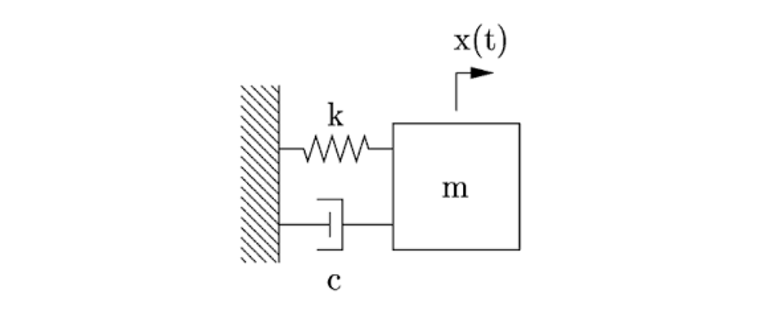

# Damped-Spring-PINN

This project demonstrates a Physics-Informed Neural Network (PINN) applied to the underdamped harmonic oscillator. By incorporating the laws of physics directly into the training process, the model learns to approximate the oscillatory motion of the spring with high accuracy. The application allows users to visualize the predicted dynamics compared to the analytical solution, highlighting how machine learning can be used to solve differential equations in physics and engineering.

---

# System Equations

In this case, no external force is applied to the system. The free-body diagram is shown below:

Where:  
- $m$: Mass  
- $k$: Spring stiffness  
- $c$: Viscous damping coefficient  
- $x(0)$: Initial displacement  
- $v(0)$: Initial velocity  

The governing differential equation is:  
$ m\ddot{x} + c\dot{x} + kx = 0 $

---

# Underdamped Case

For the underdamped case, the discriminant is:  
$ \Delta = c^2 - 4km < 0 $

The analytical solution is:  
$ x(t) = e^{-\zeta \omega_n t} \left( A \cos(\omega_d t) + B \sin(\omega_d t) \right) $

Where:  
- Natural frequency:  
  $ \omega_n = \sqrt{\tfrac{k}{m}} $  

- Damping ratio:  
  $ \zeta = \tfrac{c}{2m\omega_n} = \tfrac{c}{2\sqrt{km}} $  

- Damped frequency:  
  $ \omega_d = \omega_n \sqrt{1 - \zeta^2} $

